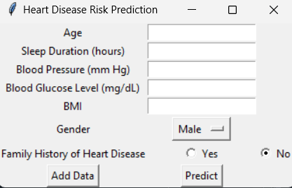
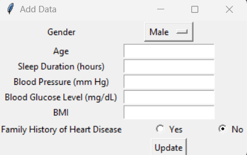

# Simple Python | Heart Disease Prediction

__IDE: Anaconda Navigator | Spyder__

## Learning:
This is a simple prediction project using Python programming language. Through this project, you can learn the basic use of Python in data processing. You can learn how to use Python for data processing for prediction and also about linear regression. Here used the tKinter library. So, you will have a visual representation of data prediction. You can predict and Add new data to the dataset.

**Screenshots:**

