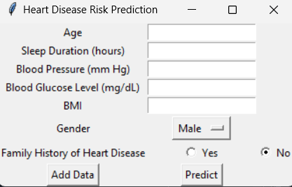
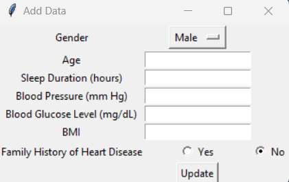

# Heart Disease Risk Prediction System 🫀

This project is a **Heart Disease Risk Prediction System** built with Python. It uses **Logistic Regression** for predicting the risk of heart disease based on health parameters provided by the user. A **Tkinter-based GUI** allows users to input data easily and view predictions visually. The system also supports adding new data to the dataset for future model updates.

## 🚀 Features

* 🩺 Predict **heart disease risk** based on user health data.
* 📈 Uses **Logistic Regression** for prediction.
* 🎨 Interactive **Tkinter GUI** for easy input and results display.
* ➕ Allows users to **add new health data** to the dataset.
* 📊 Displays **model accuracy**, confusion matrix, and classification report.
* 💾 Saves and loads trained models using `pickle` for future use.

---

## 🗂 Dataset

The system uses a CSV dataset: **`health_data.csv`**
It includes the following features:

* `Gender`
* `Age`
* `Sleep Duration (hours)`
* `Blood Pressure (mm Hg)`
* `Blood Glucose Level (mg/dL)`
* `BMI`
* `Family History of Heart Disease`
* `Health Outcome` (Target variable: `1` = High risk, `0` = Low risk)

---

## 🛠 Tech Stack

* **Python 3**
* **Pandas** (data handling)
* **NumPy** (numerical operations)
* **Scikit-learn** (Logistic Regression, preprocessing pipeline)
* **Tkinter** (Graphical User Interface)
* **Matplotlib** (for dataset visualization)
* **Pickle** (model persistence)

---

## 🖥 How it Works

1. **Train the Model**
   The model is trained on 50% of the dataset using Logistic Regression.

2. **User Inputs via GUI**
   Users input data such as age, blood pressure, glucose level, etc.

3. **Prediction**
   The system predicts whether the user has a **High Risk** or **Low Risk** of heart disease.

4. **Add New Data**
   Users can add new health records, which are saved to `health_data.csv`.

5. **Model Persistence**
   Trained models are saved as `final_model1.nom` for later use.

---

## 📸 Screenshots

### 🖤 Main Prediction Window



### ➕ Add Data Window



---

## 📊 Example Output

```
Prediction: High Risk
Accuracy: 87.50%
Confusion Matrix:
[[12  3]
 [ 2 13]]
Classification Report:
              precision    recall  f1-score   support

           0       0.86      0.80      0.83        15
           1       0.81      0.87      0.84        15

    accuracy                           0.83        30
   macro avg       0.83      0.83      0.83        30
weighted avg       0.83      0.83      0.83        30
```

---

## 💡 Learning Outcomes

* Understand how to **process health data** with Python.
* Build **machine learning pipelines** with scikit-learn.
* Create **interactive GUI applications** using Tkinter.
* Learn **model saving/loading** for deployment.
* Explore how **data visualization** and preprocessing improve predictions.
